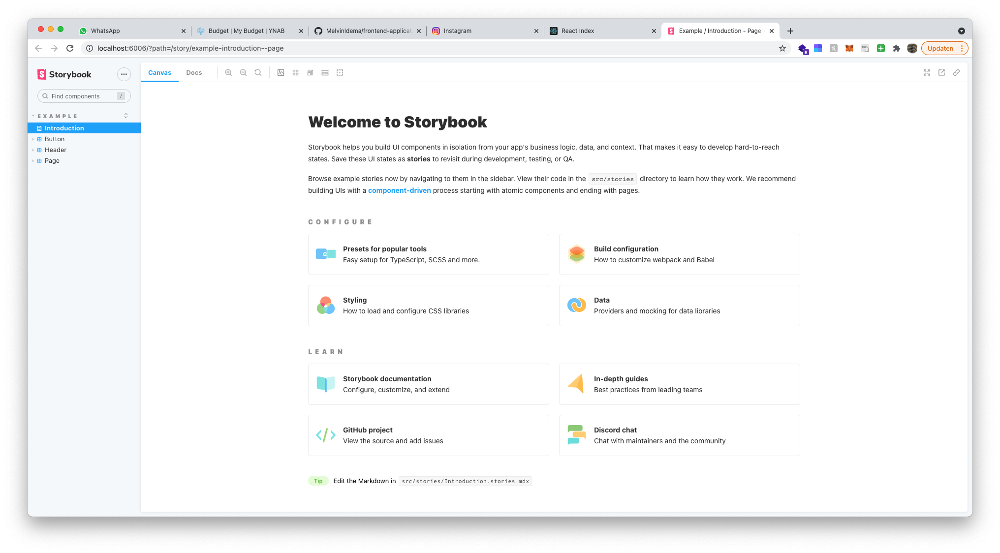

# Week 1

## Day 1
In de ochtend hebben we uitgebreid uitgelegd gekregen wat
React is, hoe je het gebruikt en een aantal basis principes
van Frameworks.

Daarna ben ik op zoek gegaan naar een oud project van m'n stage.
Daar gebruikten we namelijk React met NextJS en Typescript. Helaas
kon ik dat project niet meer vinden. Dus het wordt uit m'n hoofd
het project structureren.

Ik weet nog dat we styled-components gebruikte, dus dat is dan
ook wat ik in dit project wil gebruiken. Styled-Components raad
aan om een babel plugin te gebruiken. Hiervoor moest ik wel
CRA "ejecten". In de webpack config heb ik vervolgens de styled-components
babel plugin geload.

Daarna ben ik gaan uitzoeken hoe je ook alweer styled-components 
gebruikt in je React applicatie en wat getest. Maar ook wat het
voordeel hiervan was. Namelijk dat je CSS scoped is voor het 
specifieke component. En dat je conditionele styling kunt toepassen
gebaseerd op de meegegeven props.

Dit laat mij ook denken aan hoe je je React componenten zo functional
mogelijk moet laten zijn. Dit past goed bij mijn vorige code met D3; 
waarbij ik een functie schreef die een PieChart maakte. En daarmee
twee verschillende PieCharts liet zien.

Na het instellen van m'n React applicatie ben ik een custom hook
gaan schrijven: useFetch. Die de meeste logica van een fetch call
op zich neemt. En vervolgens ben ik de gefetchde data van de API
gaan laten zien in de UI. 

Op m'n stage heb ik ook Storybook gebruikt; dit dwong mij heel
erg om 'atomic' te werken. Namelijk van de meest simpele component
tot steeds ingewikkelder. Dit vind ik een hele fijne manier van
werken en daarom ga ik het in dit project ook gebruiken.

Genoeg voor vandaag.

## Dag 2
Aangezien ik al ervaring heb met React heb ik besloten om vandaag de presentatie
te skippen en gewoon direct door te gaan met waar ik mee bezig was gisteren. 
Namelijk het opzetten van Storybook.

Bij het opzetten bedenk ik mij dat het schrijven van de useFetch custom hook eigenlijk 
nog helemaal niet nodig was. Aangezien de componenten zo functional mogelijk moeten zijn.
Dus de data wordt meegegeven via props. Hierdoor heb je de API call nog helemaal niet nodig.

Voor nu heb ik de API-code uitgecomment voor later gebruik. Storybook is ondertussen ook
klaar voor gebruik:

Storybook kijkt voor haar "stories" naar bestanden met *.stories.js in hun naam. Ik heb de
standaard stories map verwijderd en de volgende mappenstructuur aangehouden:

Voor componenten:

`components/Component/index.tsx // Voor het component`
`components/Component/index.stories.tsx // Voor de bijbehorende story`
`components/Component/style.ts // Voor styled-components`

## Dag 3
